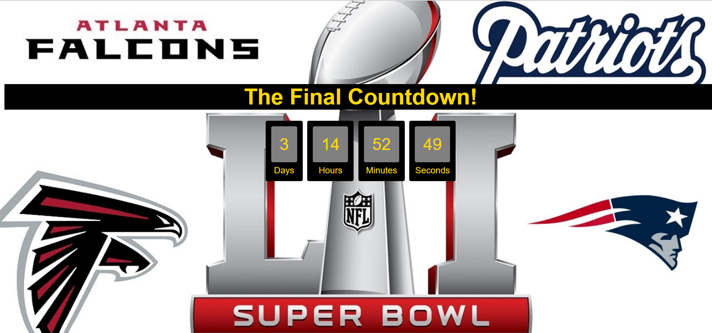

# Superbowl-Countdown

Link to Live site: https://chrisgrindereng.github.io/Superbowl-Countdown/

###Technologies, Frameworks and Programming Languages:
JavaScript, HTML, CSS

###Overview of Project:
- With the Superbowl in Houston just around the corner, I wanted to make a countdown clock to the start of the game as a way of practicing JavaScript. 

###Challenges Faced and Solutions Used: 
- The real challenge was giving the clock the ability to count down from a particular date. To overcome this I was able to use a modulo function to give a remainder from the Date() function when divided by the proper formatting value. 

###Error Handling and Troubleshooting:
- My main method of troubleshooting with this application was using developer tools in Chrome when running the web site. This gave me access to view values I displayed in the console as well as JavaScript errors. 
- In addition, I was able to test output of the functions in JSFiddle before implementing them into the application.

###MVP(Minimum Viable Product) and Stretch Goals: 
###MVP
  - Build a clock that counts down from the date and time of the Superbowl.
###Stretch Goals
  - Add styling elements. 

###Contributions to be added:
- Add a music playing function.
- Add a feature for when the clock time hits 00 00 00.

